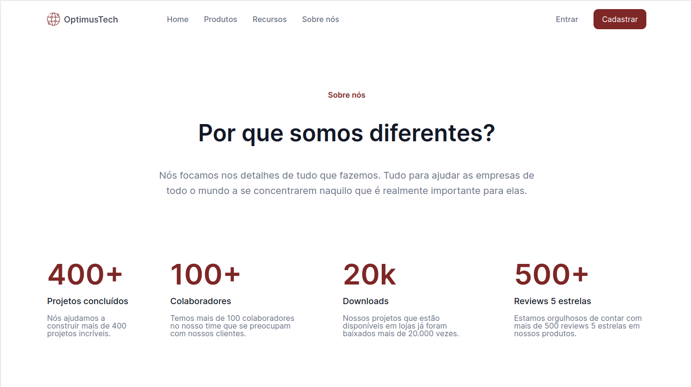

# OptimusTech | Projeto 7DaysOfCode

Projeto desenvolvido para colocar em prática os conceitos desenvolvidos na formação HTMl e CSS da Alura.

| :placard: Vitrine.Dev |     |
| -------------  | --- |
| :sparkles: Nome        | **OptimusTech**
| :label: Tecnologias | HTML, CSS (tecnologias utilizadas)
| :rocket: URL         | https://yapeansa.github.io/7daysOfCode
| :fire: Desafio     | https://yapeansa.github.io/7daysOfCode

<!-- Inserir imagem com a #vitrinedev ao final do link -->

<!--
## Detalhes do projeto

Textos e imagens que descrevam seu projeto, suas conquistas, seus desafios, próximos passos, etc...
-->
